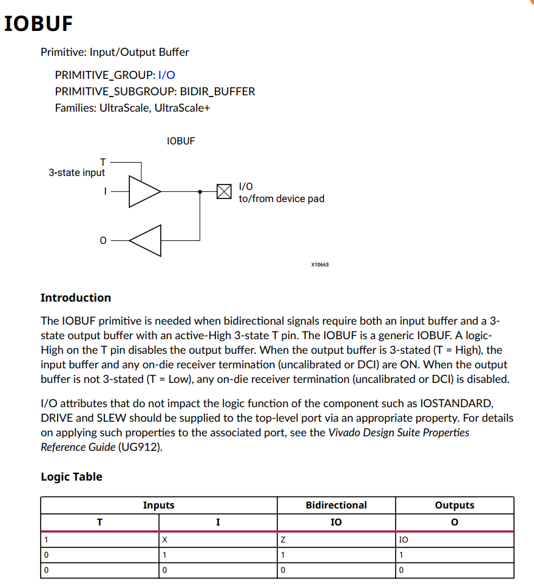
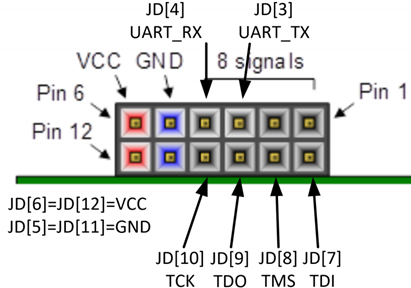
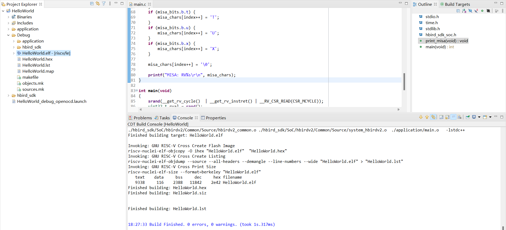
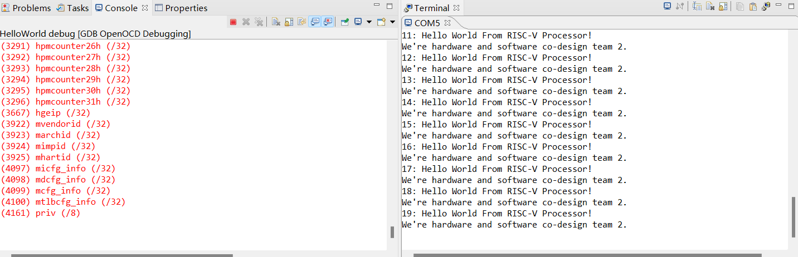
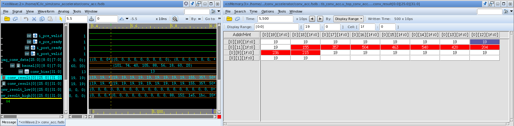

[TOC]

# E203_CNN_Genesys2

Final Project of Software_Hardware_Co-Design_24Spring. FPGA-based RISC-V+ Convolutional Acceleration Unit.


# e203移植

## include的文件设置为verilog header和 global include


## e203移植

### 时钟和复位移植

```verilog
    input wire CLK200M_p    , // Genesys2 has a differential LVDS 200MHz oscillator
    input wire CLK200M_n    ,
    input wire fpga_rst     , // R19 button. When pressing, value = 0
    
    
    wire clk_16M        ;   // 16MHz clock
    wire CLK32768KHZ    ;   // 32768KHz clock
    wire mmcm_locked    ;   // mmcm_locked
    wire ck_rst         ;   // wire reset_periph;

    clk_wiz_0 u1_clk_wiz ( 
        .clk_in1_n  (CLK200M_n  ), 
        .clk_in1_p  (CLK200M_p  ), 
        .resetn     (ck_rst     ),//active low 
        .locked     (mmcm_locked), 
        .clk_out1   (clk_16M    ) 
    ); 

    clk_div u1_clk_div( 
        .clk        (clk_16M    ), 
        .rst_n      (ck_rst     ), 
        .clk_div    (CLK32768KHZ) 
    ); 

    // assign ck_rst = fpga_rst & mcu_rst;
    assign ck_rst = fpga_rst;
```

### JTAG/UART移植

IOBUF原语

```verilog
// IOBUF: Single-ended Bi-directional Buffer
// All devices
// Xilinx HDL Language Template, version 2020.1
IOBUF #(
.DRIVE(12), // Specify the output drive strength
.IBUF_LOW_PWR("TRUE"), // Low Power - "TRUE", High Performance = "FALSE"
.IOSTANDARD("DEFAULT"), // Specify the I/O standard
.SLEW("SLOW") // Specify the output slew rate
) IOBUF_inst (
.O(O), // Buffer output
.IO(IO), // Buffer inout port (connect directly to top-level port)
.I(I), // Buffer input
.T(T) // 3-state enable input, high=input, low=output
);
// End of IOBUF_inst instantiation
```



使用Genesys2的PMOD\_JD作为JTAG/UART连接口：



```verilog
    // JD (used for JTAG connection)
    inout wire mcu_TDO      ,   //MCU_TDO-N17
    inout wire mcu_TCK      ,   //MCU_TCK-P15 
    inout wire mcu_TDI      ,   //MCU_TDI-T18
    inout wire mcu_TMS      ,   //MCU_TMS-P17
    

    wire iobuf_jtag_TCK_o;
    IOBUF
    #(
      .DRIVE(12),
      .IBUF_LOW_PWR("TRUE"),
      .IOSTANDARD("DEFAULT"),
      .SLEW("SLOW")
    )
    IOBUF_jtag_TCK
    (
      .O(iobuf_jtag_TCK_o),
      .IO(mcu_TCK),
      .I(1'b0),
      .T(1'b1)
    );
    assign dut_io_pads_jtag_TCK_i_ival = iobuf_jtag_TCK_o ;
    PULLUP pullup_TCK (.O(mcu_TCK));
    
    wire iobuf_jtag_TMS_o;
    IOBUF
    #(
      .DRIVE(12),
      .IBUF_LOW_PWR("TRUE"),
      .IOSTANDARD("DEFAULT"),
      .SLEW("SLOW")
    )
    IOBUF_jtag_TMS
    (
      .O(iobuf_jtag_TMS_o),
      .IO(mcu_TMS),
      .I(1'b0),
      .T(1'b1)
    );
    assign dut_io_pads_jtag_TMS_i_ival = iobuf_jtag_TMS_o;
    PULLUP pullup_TMS (.O(mcu_TMS));
    
    wire iobuf_jtag_TDI_o;
    IOBUF
    #(
      .DRIVE(12),
      .IBUF_LOW_PWR("TRUE"),
      .IOSTANDARD("DEFAULT"),
      .SLEW("SLOW")
    )
    IOBUF_jtag_TDI
    (
      .O(iobuf_jtag_TDI_o),
      .IO(mcu_TDI),
      .I(1'b0),
      .T(1'b1)
    );
    assign dut_io_pads_jtag_TDI_i_ival = iobuf_jtag_TDI_o;
    PULLUP pullup_TDI (.O(mcu_TDI));
    
    wire iobuf_jtag_TDO_o;
    IOBUF
    #(
      .DRIVE(12),
      .IBUF_LOW_PWR("TRUE"),
      .IOSTANDARD("DEFAULT"),
      .SLEW("SLOW")
    )
    IOBUF_jtag_TDO
    (
      .O(iobuf_jtag_TDO_o),
      .IO(mcu_TDO),
      .I(dut_io_pads_jtag_TDO_o_oval),
      .T(~dut_io_pads_jtag_TDO_o_oe)
    );

```

## HelloWorld

根据文档创建HelloWorld例子

[ 4.5. How to develop with Nuclei Studio(Ver.2022-04) — Hummingbirdv2 E203 Core and SoC 0.2.1 documentation  https://doc.nucleisys.com/hbirdv2/quick\_start/ide\_latest.html](https://doc.nucleisys.com/hbirdv2/quick_start/ide_latest.html " 4.5. How to develop with Nuclei Studio(Ver.2022-04) — Hummingbirdv2 E203 Core and SoC 0.2.1 documentation  https://doc.nucleisys.com/hbirdv2/quick_start/ide_latest.html")



连接调试器




## vivado固化流程

> ref
>
>  https://blog.csdn.net/qq_39507748/article/details/116072620

Genesys2 Flash Type : s25fl256sxxxxxx0


# e203 axi

在e203 core引出axi接口，桥接到gpio，通过**Nuclei**工具链编译调试，控制gpio点亮LED。


# cnn 卷积加速器

训练模型，量化权重

``` shell
To enable the following instructions: SSE SSE2 SSE3 SSE4.1 SSE4.2 AVX AVX2 AVX_VNNI FMA, in other operations, rebuild TensorFlow with the appropriate compiler flags.
Epoch 1/5
422/422 [==============================] - 2s 4ms/step - loss: 2.9520 - accuracy: 0.6470 - val_loss: 0.4986 - val_accuracy: 0.9043
Epoch 2/5
422/422 [==============================] - 1s 3ms/step - loss: 1.7007 - accuracy: 0.7207 - val_loss: 0.5097 - val_accuracy: 0.9197
Epoch 3/5
422/422 [==============================] - 1s 4ms/step - loss: 1.5168 - accuracy: 0.7340 - val_loss: 0.5317 - val_accuracy: 0.9268
Epoch 4/5
422/422 [==============================] - 1s 3ms/step - loss: 1.4396 - accuracy: 0.7366 - val_loss: 0.5422 - val_accuracy: 0.9267
Epoch 5/5
422/422 [==============================] - 1s 3ms/step - loss: 1.4085 - accuracy: 0.7364 - val_loss: 0.5607 - val_accuracy: 0.9307
313/313 [==============================] - 0s 914us/step - loss: 1.3088 - accuracy: 0.9188
Test Accuracy: 0.9187999963760376
[array([[[[ 20.]],

        [[ 60.]],

        [[ 18.]]],


       [[[ 56.]],

        [[ 88.]],

        [[105.]]],


       [[[ 40.]],

        [[ 74.]],

        [[101.]]]], dtype=float32), array([19.], dtype=float32)]
[]
[array([[ -7.,  29.,  -5., ...,  16., -29.,   4.],
       [  1.,  27.,  -6., ...,   8., -20.,  -8.],
       [  1.,  16.,  -9., ...,  10., -26.,   2.],
       ...,
       [  1.,  28.,  -2., ...,   5., -22.,   3.],
       [-15.,  21.,  -7., ...,   3., -26.,   2.],
       [ -6.,  25., -11., ...,   9., -18.,   2.]], dtype=float32), array([ -4.,  15.,  -3.,  -8.,   5.,  10.,  -2.,   9., -18.,  -3.],
      dtype=float32)]
[]
```


> ref
>
> https://blog.csdn.net/qq_42025108/article/details/113134186


将卷积加速器模块封装为带axi接口的ip，主机通过axi写入开始信号，卷积模块开始识别，结果输出到led上。


``` verilog
	// Add user logic here
    top_conv_acc u_top_conv_acc(
    .i_clk                              (S_AXI_ACLK                     ),
    .i_rstn                             (S_AXI_ARESETN                  ), 
    .i_start                            (slv_reg0[0]                    ),
    .o_res                              (led                            ) 
    );

	// User logic ends
```


test.py运行识别程序，大约耗时4,965,900 ns。

``` shell
Fully Connected Layer Result: [[ -308921  -658985  1199098  -267905 -1924023  -129580  -191511 -2645061
    -16240 -1799078]]
最大值是: 1199098
Final Recognition Result: 2
Recognition cost： 4965900 ns
```


加速器运算大约耗时10,205ns。


python卷积前两行结果：

 

卷积模块前两行结果：




卷运算结果一致。


# e203_cnn_soc

通过AXI Interconnect实现卷积模块与e203的互联，卷积模块地址从0x40000000开始。


通过**Nuclei**工具链编译调试，延时10s，向地址0x40000000最低位写1，给卷积模块发送启动信号，卷积模块开始识别，根据识别结果点亮对应的led。


``` C
#define CONV_AXI_REG0_ADDR 0x40000000

	printf("Please wait 10s for recognition\n");
    delay_1ms(10000);

    unsigned int* p_reg0;
    p_reg0 = (unsigned int *)CONV_AXI_REG0_ADDR;

    *p_reg0 = 0x00000001;

    delay_1ms(500);
    printf("recognition success!\n");
    delay_1ms(10000);
```


# PPA

- Power


- Ultilization


- Timing


# 不足与改进

## 总结
- 本项目完成了模型训练、前向量化、硬件设计的全流程设计，可以快速迁移到基于各种数据集的图像分类的应用上。
- 实现了对单张图片（来自片上）进行快速识别
- 体会：通过本项目的研究和探索，我们学习了深度学习的知识和嵌入式系统构建与实操，完成了神经网络加速器的硬件实现及其性能优化。系统性能达到了满意的效果。感谢课程的授课老师和学长们为我们提供了这样一个锻炼动手能力的机会和交流项目经验的平台，以及指导。
## 后续工作
实现对单张图片（来自片外）进行快速识别
多张图片
在卷积后数据变成了32位，输入到全连接之前可以尝试截断为8位。
加入全连接层的偏置计算。


- 图片以及权重数据通过AXI传输或使用BROM存储
- 使用脉动阵列实现卷积
- 设计流水线提高吞吐量
