# 软硬件协同设计

## 目录

- [e203](#e203)
  - [关于代码风格 if else | ? : ](#关于代码风格-if-else----)
    - [test1](#test1)
      - [代码](#代码)
      - [仿真和综合](#仿真和综合)
      - [vivado](#vivado)
    - [test2](#test2)
      - [代码](#代码)
      - [仿真和综合](#仿真和综合)
      - [vivado](#vivado)
  - [include的文件设置为verilog header和 global include](#include的文件设置为verilog-header和-global-include)
  - [e203移植](#e203移植)
    - [时钟和复位移植](#时钟和复位移植)
    - [JTAG/UART移植](#JTAGUART移植)
  - [HelloWorld](#HelloWorld)
  - [LED](#LED)
  - [coremark](#coremark)
  - [dhrystone](#dhrystone)

# e203

## 关于代码风格 if else | ? :&#x20;

### test1

#### 代码

```verilog
module test(
    input  wire a1,
    input  wire a2,
    input  wire in1,
    input  wire in2,
    input  wire in3,
    input  wire in4,
    output wire out1,
    output wire out2
);

    reg out1_r;
    always @(*) begin
        if (a1) begin
            out1_r = in1;
        end else begin
            out1_r = in2;
        end
    end
    assign out1 = out1_r;

    assign out2 = a2 ? in3 : in4;
    
endmodule
```

#### 仿真和综合

- 仿真

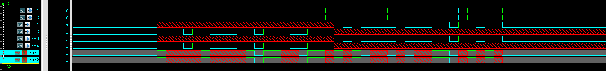

- DC GTECH


- DC TSMC90

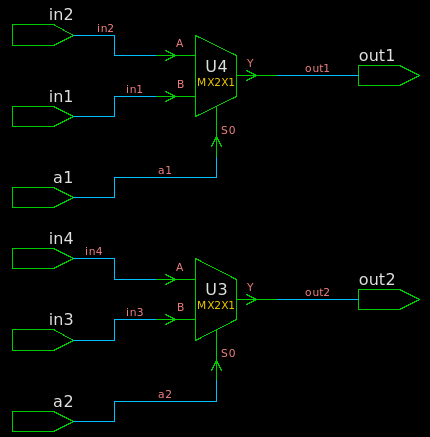

#### vivado

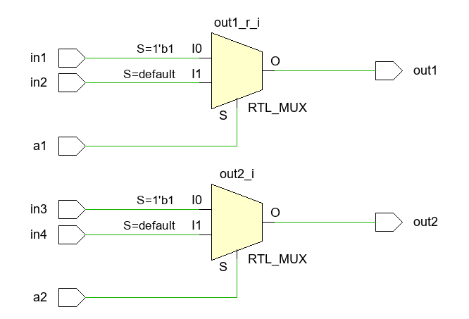

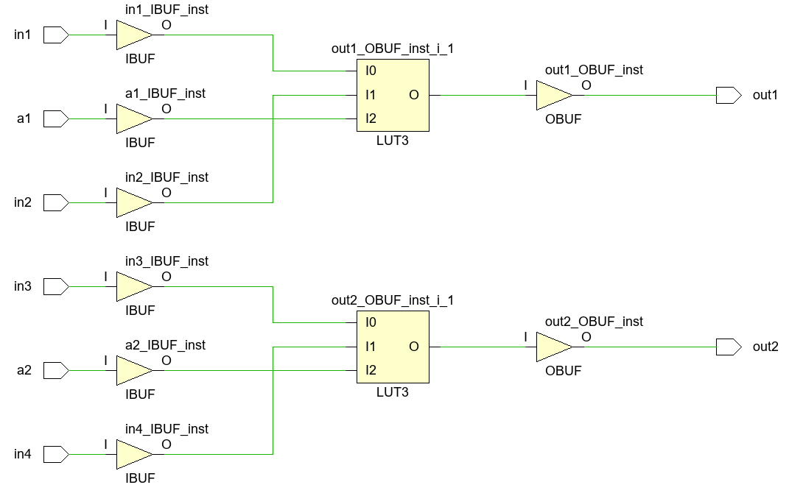

### test2

#### 代码

```verilog
module test2(
    input  wire [1:0] a1,
    input  wire       in1 ,
    input  wire       in2 ,
    input  wire       in3 ,
    output wire       out1,

    input  wire [1:0] a2,
    input  wire       in4 ,
    input  wire       in5 ,
    input  wire       in6 ,
    output wire       out2,

    input  wire [1:0] a3,
    input  wire       in7 ,
    input  wire       in8 ,
    input  wire       in9 ,
    output wire       out3
);

    // if else statement
    reg out1_buf;
    always @(*) begin
        if (a1 == 2'b01) begin
            out1_buf = in1;
        end else if (a1 == 2'b10) begin
            out1_buf = in2;
        end else begin
            out1_buf = in3;
        end
    end
    assign out1 = out1_buf;

    // ternary operator
    assign out2 = (a2 == 2'b01) ? in4 : 
                  (a2 == 2'b10) ? in5 : in6;

    // case statement
    reg out3_buf;
    always @( *) begin
       case (a3)
           2'b01: out3_buf = in7;
           2'b10: out3_buf = in8;
           default: out3_buf = in9;       
       endcase 
    end
    assign out3 = out3_buf;

endmodule
```

#### 仿真和综合

- 仿真

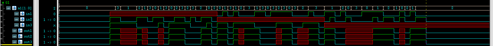

- DC GTEC

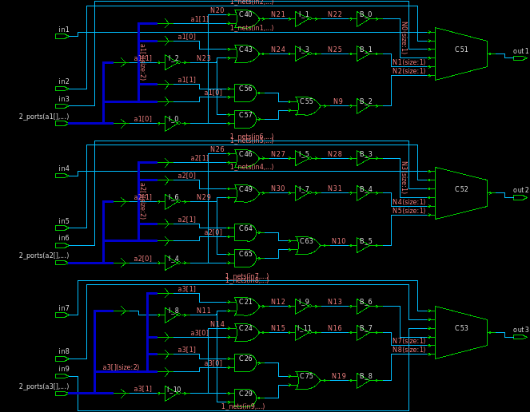

- DC TSMC

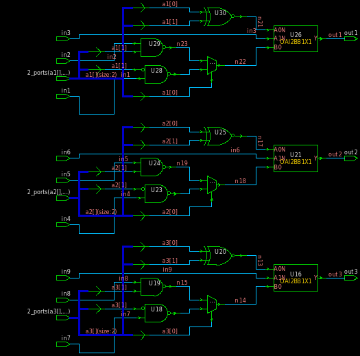

#### vivado

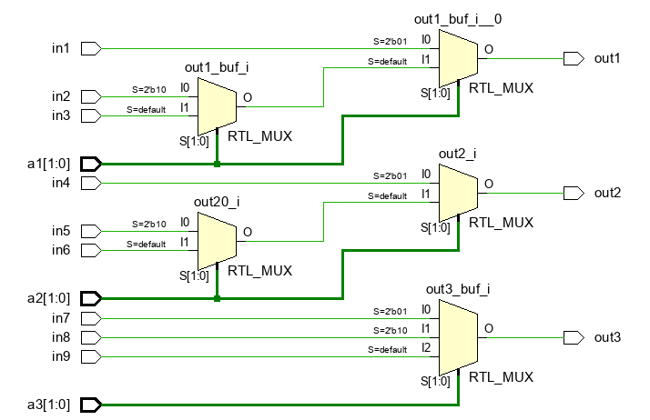

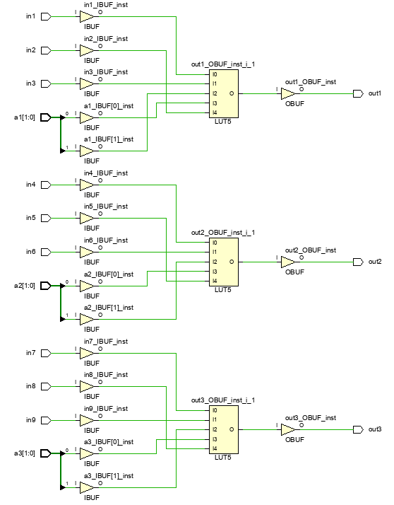

## include的文件设置为verilog header和 global include

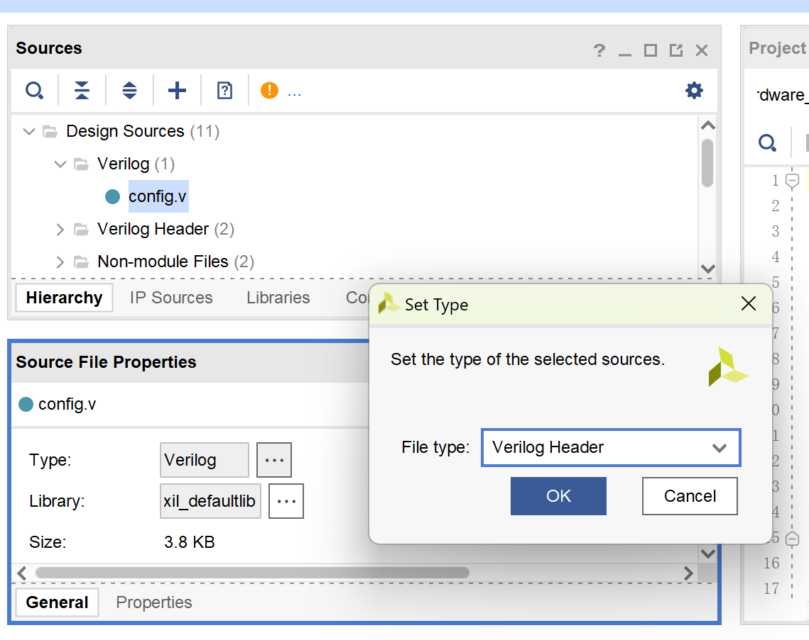


## e203移植

### 时钟和复位移植

```verilog
    input wire CLK200M_p    , // Genesys2 has a differential LVDS 200MHz oscillator
    input wire CLK200M_n    ,
    input wire fpga_rst     , // R19 button. When pressing, value = 0
    
    
    wire clk_16M        ;   // 16MHz clock
    wire CLK32768KHZ    ;   // 32768KHz clock
    wire mmcm_locked    ;   // mmcm_locked
    wire ck_rst         ;   // wire reset_periph;

    clk_wiz_0 u1_clk_wiz ( 
        .clk_in1_n  (CLK200M_n  ), 
        .clk_in1_p  (CLK200M_p  ), 
        .resetn     (ck_rst     ),//active low 
        .locked     (mmcm_locked), 
        .clk_out1   (clk_16M    ) 
    ); 

    clk_div u1_clk_div( 
        .clk        (clk_16M    ), 
        .rst_n      (ck_rst     ), 
        .clk_div    (CLK32768KHZ) 
    ); 

    // assign ck_rst = fpga_rst & mcu_rst;
    assign ck_rst = fpga_rst;
```

### JTAG/UART移植

IOBUF原语

```verilog
// IOBUF: Single-ended Bi-directional Buffer
// All devices
// Xilinx HDL Language Template, version 2020.1
IOBUF #(
.DRIVE(12), // Specify the output drive strength
.IBUF_LOW_PWR("TRUE"), // Low Power - "TRUE", High Performance = "FALSE"
.IOSTANDARD("DEFAULT"), // Specify the I/O standard
.SLEW("SLOW") // Specify the output slew rate
) IOBUF_inst (
.O(O), // Buffer output
.IO(IO), // Buffer inout port (connect directly to top-level port)
.I(I), // Buffer input
.T(T) // 3-state enable input, high=input, low=output
);
// End of IOBUF_inst instantiation
```

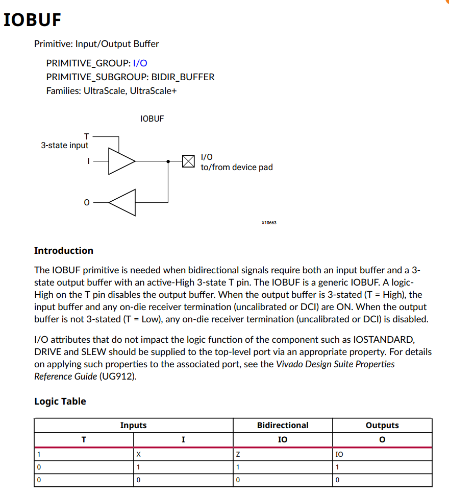

使用Genesys2的PMOD\_JD作为JTAG/UART连接口：

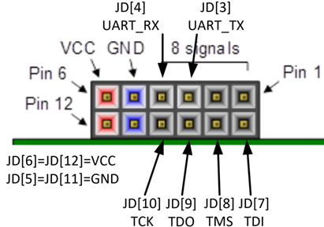

```verilog
    // JD (used for JTAG connection)
    inout wire mcu_TDO      ,   //MCU_TDO-N17
    inout wire mcu_TCK      ,   //MCU_TCK-P15 
    inout wire mcu_TDI      ,   //MCU_TDI-T18
    inout wire mcu_TMS      ,   //MCU_TMS-P17
    

    wire iobuf_jtag_TCK_o;
    IOBUF
    #(
      .DRIVE(12),
      .IBUF_LOW_PWR("TRUE"),
      .IOSTANDARD("DEFAULT"),
      .SLEW("SLOW")
    )
    IOBUF_jtag_TCK
    (
      .O(iobuf_jtag_TCK_o),
      .IO(mcu_TCK),
      .I(1'b0),
      .T(1'b1)
    );
    assign dut_io_pads_jtag_TCK_i_ival = iobuf_jtag_TCK_o ;
    PULLUP pullup_TCK (.O(mcu_TCK));
    
    wire iobuf_jtag_TMS_o;
    IOBUF
    #(
      .DRIVE(12),
      .IBUF_LOW_PWR("TRUE"),
      .IOSTANDARD("DEFAULT"),
      .SLEW("SLOW")
    )
    IOBUF_jtag_TMS
    (
      .O(iobuf_jtag_TMS_o),
      .IO(mcu_TMS),
      .I(1'b0),
      .T(1'b1)
    );
    assign dut_io_pads_jtag_TMS_i_ival = iobuf_jtag_TMS_o;
    PULLUP pullup_TMS (.O(mcu_TMS));
    
    wire iobuf_jtag_TDI_o;
    IOBUF
    #(
      .DRIVE(12),
      .IBUF_LOW_PWR("TRUE"),
      .IOSTANDARD("DEFAULT"),
      .SLEW("SLOW")
    )
    IOBUF_jtag_TDI
    (
      .O(iobuf_jtag_TDI_o),
      .IO(mcu_TDI),
      .I(1'b0),
      .T(1'b1)
    );
    assign dut_io_pads_jtag_TDI_i_ival = iobuf_jtag_TDI_o;
    PULLUP pullup_TDI (.O(mcu_TDI));
    
    wire iobuf_jtag_TDO_o;
    IOBUF
    #(
      .DRIVE(12),
      .IBUF_LOW_PWR("TRUE"),
      .IOSTANDARD("DEFAULT"),
      .SLEW("SLOW")
    )
    IOBUF_jtag_TDO
    (
      .O(iobuf_jtag_TDO_o),
      .IO(mcu_TDO),
      .I(dut_io_pads_jtag_TDO_o_oval),
      .T(~dut_io_pads_jtag_TDO_o_oe)
    );

```

## HelloWorld

根据文档创建HelloWorld例子

[ 4.5. How to develop with Nuclei Studio(Ver.2022-04) — Hummingbirdv2 E203 Core and SoC 0.2.1 documentation  https://doc.nucleisys.com/hbirdv2/quick\_start/ide\_latest.html](https://doc.nucleisys.com/hbirdv2/quick_start/ide_latest.html " 4.5. How to develop with Nuclei Studio(Ver.2022-04) — Hummingbirdv2 E203 Core and SoC 0.2.1 documentation  https://doc.nucleisys.com/hbirdv2/quick_start/ide_latest.html")

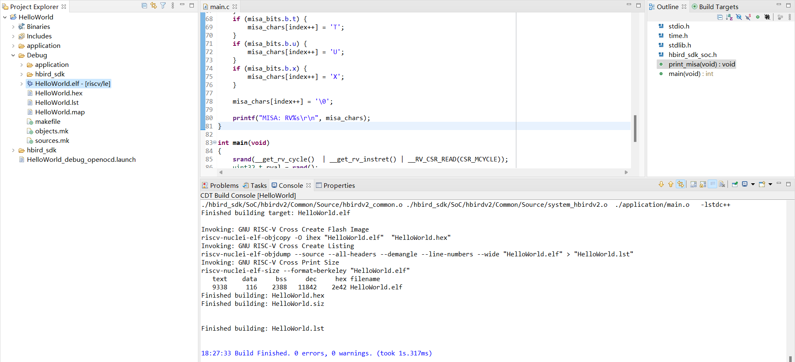

连接调试器

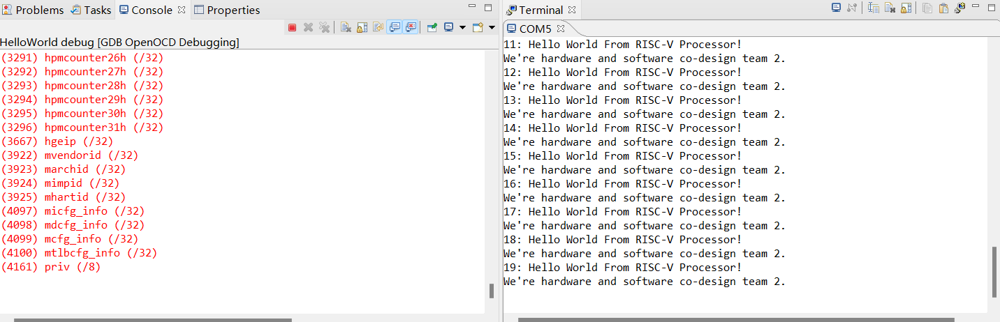

## LED

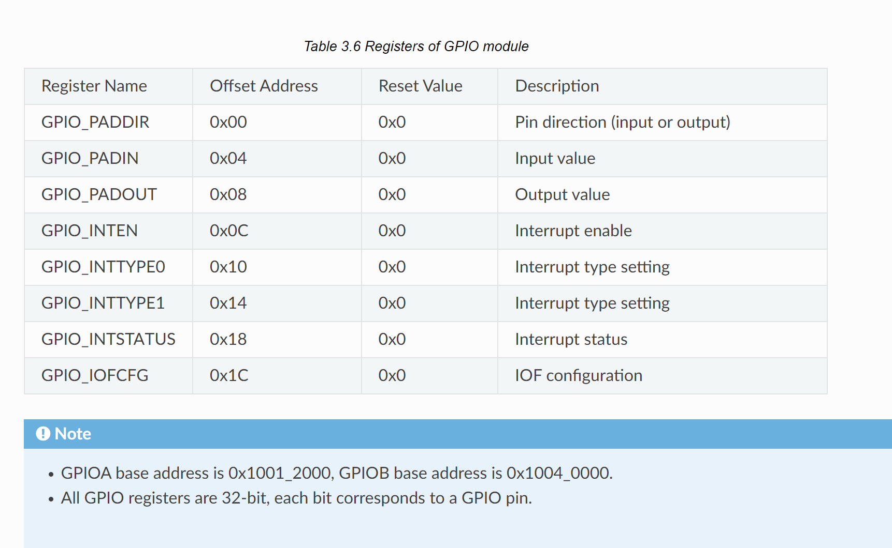

```c
void led_blink() {

    gpio_enable_output(GPIOA, 1);
    gpio_write(GPIOA, 1, 1);
    gpio_enable_output(GPIOA, 2);
    gpio_write(GPIOA, 2, 0);
    gpio_enable_output(GPIOA, 4);
    gpio_write(GPIOA, 4, 0);
    delay_1ms(500);

    gpio_enable_output(GPIOA, 1);
    gpio_write(GPIOA, 1, 0);
    gpio_enable_output(GPIOA, 2);
    gpio_write(GPIOA, 2, 1);
    gpio_enable_output(GPIOA, 4);
    gpio_write(GPIOA, 4, 0);
    delay_1ms(500);

    gpio_enable_output(GPIOA, 1);
    gpio_write(GPIOA, 1, 0);
    gpio_enable_output(GPIOA, 2);
    gpio_write(GPIOA, 2, 0);
    gpio_enable_output(GPIOA, 4);
    gpio_write(GPIOA, 4, 1);
    delay_1ms(500);
    
}
```

## coremark

| 开源处理器     | 链接                                                                                                                                                            | CoreMark/MHz |
| --------- | ------------------------------------------------------------------------------------------------------------------------------------------------------------- | ------------ |
| E203      | [https://github.com/riscv-mcu/e203\_hbirdv2.git](https://github.com/riscv-mcu/e203_hbirdv2.git "https://github.com/riscv-mcu/e203_hbirdv2.git")               | 2.12         |
| Xiangshan | [https://github.com/OpenXiangShan/XiangShan.git](https://github.com/OpenXiangShan/XiangShan.git "https://github.com/OpenXiangShan/XiangShan.git")             | 5.3          |
| C910      | [https://github.com/GoWest279/XuanTie-C910-FPGA.git](https://github.com/GoWest279/XuanTie-C910-FPGA.git "https://github.com/GoWest279/XuanTie-C910-FPGA.git") | 7.10         |
| tinyriscv | [https://github.com/liangkangnan/tinyriscv.git](https://github.com/liangkangnan/tinyriscv.git "https://github.com/liangkangnan/tinyriscv.git")                | 2.4          |

```bash
HummingBird SDK Build Time: Apr 15 2024, 16:09:03
Download Mode: ILM
CPU Frequency 15991767 Hz
Start to run coremark for 500 iterations
2K performance run parameters for coremark.
CoreMark Size    : 666
Total ticks      : 236054487
Total time (secs): 14.761186
Iterations/Sec   : 33.872617
Iterations       : 500
Compiler version : GCC10.2.0
Compiler flags   : -O2 -funroll-all-loops -finline-limit=600 -ftree-dominator-opts -fno-if-conversion2 -fselective-scheduling -fno-code-hoisting -fno-common -funroll-loops -finline-functions -falign-functions=4 -falign-jumps=4 -falign-loops=4
Memory location  : STACK
seedcrc          : 0xe9f5
[0]crclist       : 0xe714
[0]crcmatrix     : 0x1fd7
[0]crcstate      : 0x8e3a
[0]crcfinal      : 0xa14c
Correct operation validated. See readme.txt for run and reporting rules.
CoreMark 1.0 : 33.872617 / GCC10.2.0 -O2 -funroll-all-loops -finline-limit=600 -ftree-dominator-opts -fno-if-conversion2 -fselective-scheduling -fno-code-hoisting -fno-common -funroll-loops -finline-functions -falign-functions=4 -falign-jumps=4 -falign-loops=4 / STACK


Print Personal Added Addtional Info to Easy Visual Analysis

     (Iterations is: 500
     (total_ticks is: 236054487
 (*) Assume the core running at 1 MHz
     So the CoreMark/MHz can be caculated by: 
     (Iterations*1000000/total_ticks) = 2.118155 CoreMark/MHz
```

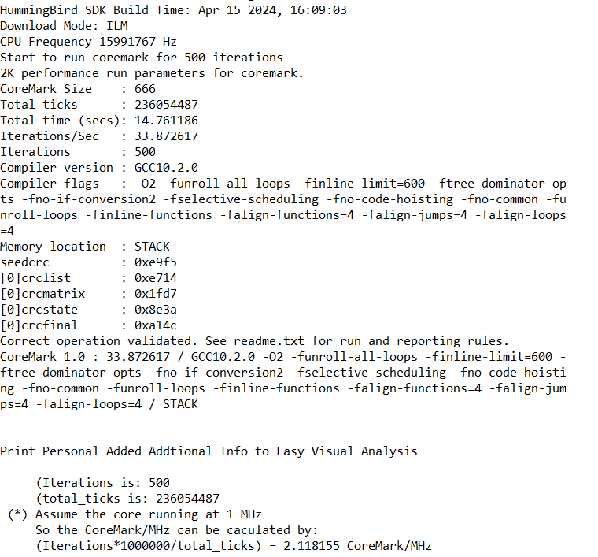

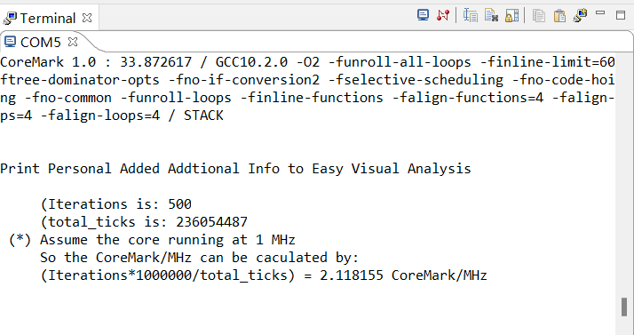

- tinyriscv

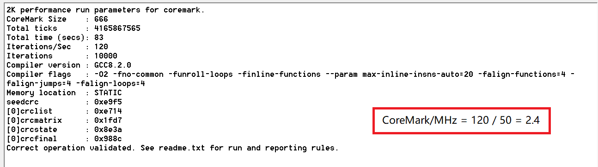

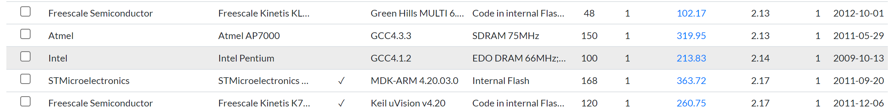

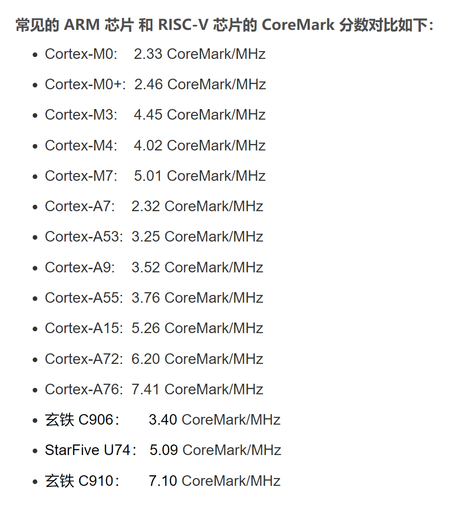

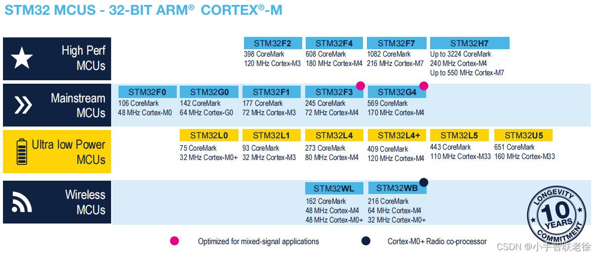

## dhrystone

```text
HummingBird SDK Build Time: Apr 15 2024, 16:19:18
Download Mode: ILM
CPU Frequency 15991439 Hz

Dhrystone Benchmark, Version 2.1 (Language: C)

Program compiled without 'register' attribute

Please give the number of runs through the benchmark: 
Execution starts, 500000 runs through Dhrystone
Execution ends

Final values of the variables used in the benchmark:

Int_Glob:            5
        should be:   5
Bool_Glob:           1
        should be:   1
Ch_1_Glob:           A
        should be:   A
Ch_2_Glob:           B
        should be:   B
Arr_1_Glob[8]:       7
        should be:   7
Arr_2_Glob[8][7]:    500010
        should be:   Number_Of_Runs + 10
Ptr_Glob->
  Ptr_Comp:          -1879035584
        should be:   (implementation-dependent)
  Discr:             0
        should be:   0
  Enum_Comp:         2
        should be:   2
  Int_Comp:          17
        should be:   17
  Str_Comp:          DHRYSTONE PROGRAM, SOME STRING
        should be:   DHRYSTONE PROGRAM, SOME STRING
Next_Ptr_Glob->
  Ptr_Comp:          -1879035584
        should be:   (implementation-dependent), same as above
  Discr:             0
        should be:   0
  Enum_Comp:         1
        should be:   1
  Int_Comp:          18
        should be:   18
  Str_Comp:          DHRYSTONE PROGRAM, SOME STRING
        should be:   DHRYSTONE PROGRAM, SOME STRING
Int_1_Loc:           5
        should be:   5
Int_2_Loc:           13
        should be:   13
Int_3_Loc:           7
        should be:   7
Enum_Loc:            1
        should be:   1
Str_1_Loc:           DHRYSTONE PROGRAM, 1'ST STRING
        should be:   DHRYSTONE PROGRAM, 1'ST STRING
Str_2_Loc:           DHRYSTONE PROGRAM, 2'ND STRING
        should be:   DHRYSTONE PROGRAM, 2'ND STRING

 (*) User_Cycle for total run through Dhrystone with loops 500000: 
221500035 
       So the DMIPS/MHz can be caculated by: 
       1000000/(User_Cycle/Number_Of_Runs)/1757 = 1.284767 DMIPS/MHz
```

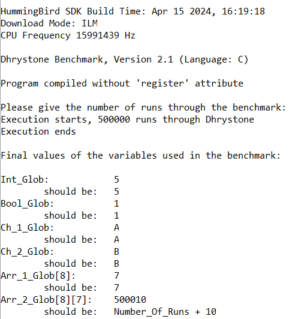

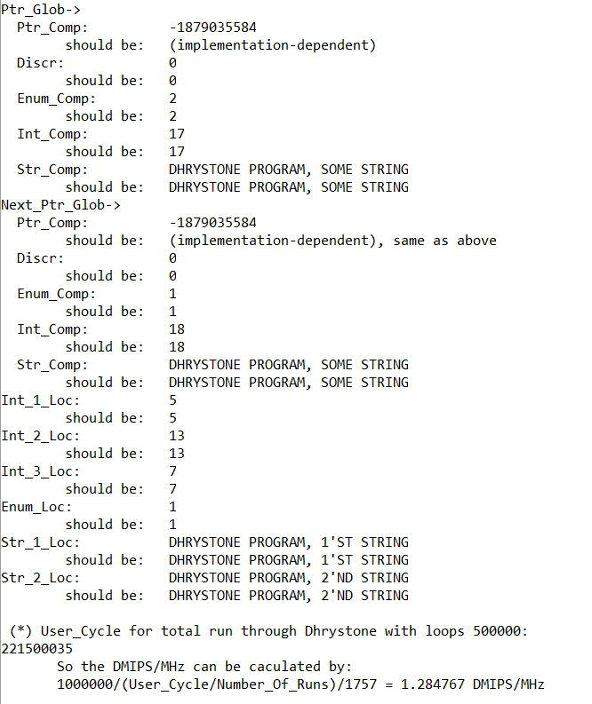


uart绑定gpioa第一个引脚

不同引脚是否不同

